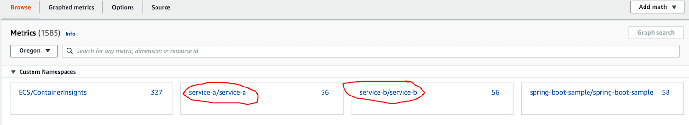
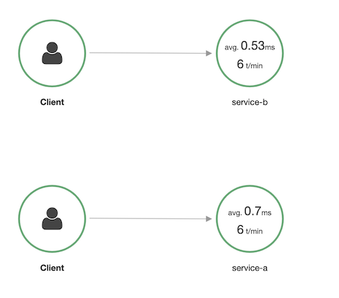
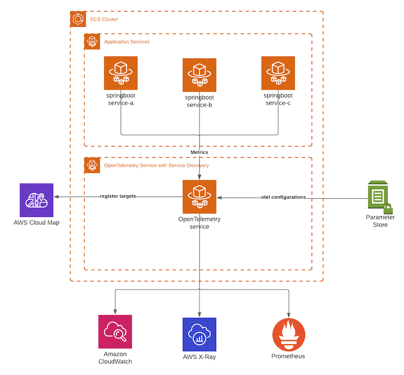

# SpringBoot integration with AWS Distro for OpenTelemetry on Amazon ECS

This project contains source code that demos the following:

- How to integrate [AWS OpenTelemetry](https://aws-otel.github.io/) with Java [SpringBoot](https://spring.io/projects/spring-boot) based microservices.
- Using [AWS OpenTelemetry](https://aws-otel.github.io/) using [Amazon ECS service pattern](https://aws.amazon.com/blogs/opensource/deployment-patterns-for-the-aws-distro-for-opentelemetry-collector-with-amazon-elastic-container-service/). 
- How to send [AWS OpenTelemetry](https://aws-otel.github.io/) metrics from ECS service to [CloudWatch Metrics](https://aws.amazon.com/cloudwatch/), [AWS X-Ray](https://aws.amazon.com/xray/) and [Amazon Managed Service for Prometheus](https://aws.amazon.com/prometheus/).
- Create nested stacks using [AWS SAM Nested applications](https://docs.aws.amazon.com/serverless-application-model/latest/developerguide/serverless-sam-template-nested-applications.html). 

The [AWS Distro for OpenTelemetry (ADOT)](https://aws.amazon.com/otel/?otel-blogs.sort-by=item.additionalFields.createdDate&otel-blogs.sort-order=desc) is a secure, production-ready, AWS-supported distribution of the OpenTelemetry project.

#### Integrating OpenTelemetry with springboot services.

This project shows how to add [java OpenTelemetry agent](https://github.com/aws-observability/aws-otel-java-instrumentation)  with popular spring boot based microservices.
Refer the `Dockerfile` in the project to see how to add the java OpenTelemetry agent without making code changes to the application.

#### Using Amazon ECS service pattern
Several patterns can be used for deploying ADOT for observability. The common ones include

- **The sidecar pattern** : A common practice in the observability world is to use sidecars to provide container instrumentation.
The [ADOT website](https://aws-otel.github.io/docs/getting-started/prometheus-remote-write-exporter/ecs) shows how to configure the AWS OTel Collector to scrape metrics using the sidecar pattern.
A main advantage of the sidecar pattern is that it is simple to configure and troubleshoot. However, when customers have thousands of microservices and multiple environments,compute cost 
of running sidecar per task can start to add up and this pattern may become expensive.

- **Amazon ECS service pattern**: The Amazon ECS service deployment pattern is similar to the [DaemonSet](https://kubernetes.io/docs/concepts/workloads/controllers/daemonset/) pattern in Kubernetes. 
An Amazon ECS service allows you to run and maintain a specified number of instances of a OTel task in ECS. 
If any of the tasks fail, the Amazon ECS service scheduler launches another task instance to replace the failed task.
If Autoscaling is added to the OpenTelemetry service, it dynamically scales as more application services are added, and they push metrics to the OpenTelemetry service.
AWS Service discovery is used with the OpenTelemetry service to provide a private namespace to the service, which can be used by application services to discover and push their metrics to OpenTelemetry service.
The main advantage of this pattern is cost saving. Compute costs are reduced because the number of instrumentation containers no longer has a 1:1 relationship with the application containers.
This project is demoing the pattern.

For more information on sidecar vs ecs service pattern please refer to this AWS [Blog](https://aws.amazon.com/blogs/opensource/deployment-patterns-for-the-aws-distro-for-opentelemetry-collector-with-amazon-elastic-container-service/).

#### Sending metrics from OpenTelemetry to CloudWatch, X-Ray & Amazon Managed Service for Prometheus

The [OpenTelemetry configuration](https://opentelemetry.io/docs/collector/configuration/) allows you to manage sources and destinations of metrics collected by the OTel.
Refer to ssm parameter in `otel-service.yaml` that contains the OpenTelemetry configuration used by the service to export metrics data to CloudWatch and Prometheus & traces data to X-Ray.

Once the project is deployed, you will be able to see 2 new namespaces in the CloudWatch metrics console.



You can also view AWS X-Ray service map




You can query Prometheus metrics using the [these techniques](https://docs.aws.amazon.com/prometheus/latest/userguide/AMP-onboard-query.html).

#### Using AWS SAM CLI Nested Applications to create and maintain nested stack
Finally, instead of using [Cloudformation nested stack](https://docs.aws.amazon.com/AWSCloudFormation/latest/UserGuide/using-cfn-nested-stacks.html) to create infrastructure we are using [AWS SAM Nested applications](https://docs.aws.amazon.com/serverless-application-model/latest/developerguide/serverless-sam-template-nested-applications.html). Cloudformation nested stack can be hard to change locally and redeploy because it
requires you to upload the updated templates to s3 bucket everytime you want to make a change. Instead, [AWS SAM cli](https://docs.aws.amazon.com/serverless-application-model/latest/developerguide/serverless-sam-cli-install.html) can manage that process for you.
Though primarily used to create serverless infrastructure, AWS SAM nested application (AWS::Serverless::Application) can  allow you to create nested stacks with a minor change to the parent Cloudformation template. AWS SAM will convert them to Cloudformation nested stacks internally before deploying.


### Solution Overview


## Deploy the sample application

> **WARNING**:
> This project creates VPC, ALB, ECS Cluster & Services, CloudMap, S3 buckets that can incur cost. Cleanup resources once done working.

The AWS SAM CLI is an extension of the AWS CLI that adds functionality for building and testing Lambda applications. 
To use the AWS SAM CLI, you need the following tools:

* AWS SAM CLI - [Install the AWS SAM CLI](https://docs.aws.amazon.com/serverless-application-model/latest/developerguide/serverless-sam-cli-install.html).
* Docker - [Install Docker community edition](https://hub.docker.com/search/?type=edition&offering=community).

To build and deploy your application for the first time, run the following in your shell:

```bash
sam build
sam deploy --guided --capabilities CAPABILITY_NAMED_IAM
```

### Cleanup

To delete the sample pipeline that you created, use the AWS CLI. Assuming you used your project name for the stack
name, you can run the following:

```bash
sam delete
```

### Resources

See
the [AWS SAM developer guide](https://docs.aws.amazon.com/serverless-application-model/latest/developerguide/what-is-sam.html)
for an introduction to SAM specification, the SAM CLI, and serverless application concepts.

### Contribution

See [CONTRIBUTING](CONTRIBUTING.md) for more information.

### License

See the [LICENSE](LICENSE) file.

